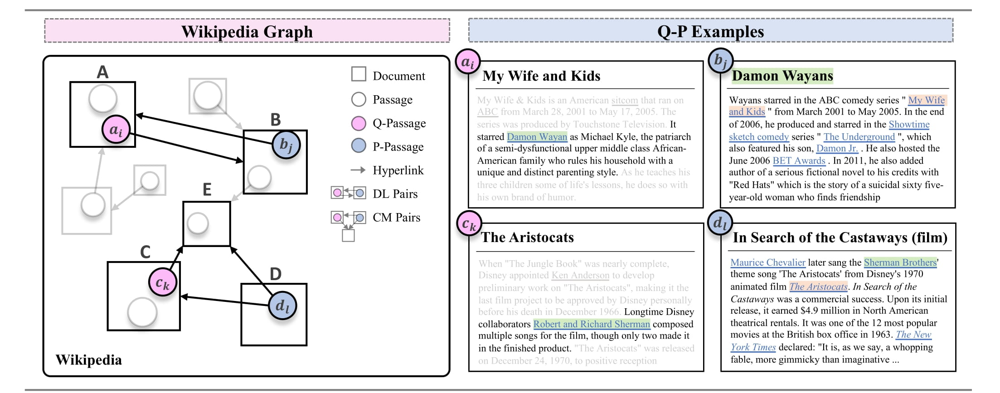

# Hyperlink-induced Pre-training for Passage Retrieval in Open-domain Question Answering


This is the official implementation of our ACL'2022 paper "[Hyperlink-induced Pre-training for Passage Retrieval in OpenQA](https://arxiv.org/pdf/2203.06942.pdf)".

Acknowledgements: our implementation is based on the [DPR](https://github.com/facebookresearch/DPR) codebase.


## Quick Links
- [Overview](https://github.com/jzhoubu/HLP#overview)
- [Setup](https://github.com/jzhoubu/HLP#setup)
  - [Installation](https://github.com/jzhoubu/HLP#installation)
  - [Prepare Data and Models](https://github.com/jzhoubu/HLP#prepare-data-and-models)
- [Experiments](https://github.com/jzhoubu/HLP#experiments) 
  - [Retriever Training](https://github.com/jzhoubu/HLP#retriever-training) 
  - [Corpus Embedding](https://github.com/jzhoubu/HLP#corpus-embedding) 
  - [Retrieval Evalutaion](https://github.com/jzhoubu/HLP#retrieval-evalutaion) 
- [Others](https://github.com/jzhoubu/HLP#others) 
  - [Data Formats for Training Retriever](https://github.com/jzhoubu/HLP#data-formats-for-training-retriever)
  - [Processed Wikipedai Graph](https://github.com/jzhoubu/HLP#processed-wikipedia-graph)
  - [Examples of HLP Q-P pairs](https://github.com/jzhoubu/HLP#examples-of-hlp-q-p-pairs)
- [Citation](https://github.com/jzhoubu/HLP#citation)

## Overview
In this paper, we propose **H**yper**L**ink-induced **P**re-training (HLP), a pre-training method to learn effective Q-P relevance induced by the hyperlink topology within naturally-occurring Web documents. Specifically, these Q-P pairs are automatically extracted from the online documents with relevance adequately designed via hyperlink-based topology to facilitate downstream retrieval for question answering. 

<p align="center"></p>

**Note**: the hyperlink-induced Q-P pairs are mostly semantically closed but lexically diverse, which could be considered/used as unsupervised paraphrase extracted from internet. Some examples are shared [here](https://github.com/jzhoubu/HLP#examples-of-hlp-q-p-pairs). 

## Setup
### Installation
1. Installation from the source. Python's virtual or Conda environments are recommended.
```bash
git clone git@github.com:jzhoubu/HLP.git
cd HLP
conda create -n hlp python=3.7
conda activate hlp
pip install -r requirements.txt
```

2. Please change the `HLP_HOME` variable in `biencoder_train_cfg.yaml`, `gen_embs.yaml` and `dense_retriever.yaml`. The `HLP_HOME` is the path to the HLP directory you download.


3. You may also need to build [apex](https://github.com/NVIDIA/apex). 
```bash
git clone https://github.com/NVIDIA/apex
cd apex
python -m pip install -v --disable-pip-version-check --no-cache-dir ./
```

### Prepare Data and Models
**[Option1]** **Download Data via Command**
```bash
bash downloader.sh
```
This command will automatically download the necessary data (about 50GB) for experiments. 


**[Option2]**  **Download Data Manually**

Please download these data to the pre-defined location in `conf/*/*.yaml`.


**Download Models**


<table width="100%" align="left" border="0" cellspacing="0" cellpadding="0" frame=void rules=none>
<tbody>
<!-- START TABLE -->
<!-- TABLE HEADER -->
<th width="10%" rowspan="3" valign="center">Models</th>
<th width="10%" rowspan="3" valign="center">Trainset</th>
<th width="10%" rowspan="3" valign="center">TrainConfig</th>
<th width="20%" rowspan="3" valign="center">Size</th>
<th width="60%" colspan="9" valign="center">Zero-shot Performance</th>

<tr>
  <td width="20%" colspan="3" align="center"> NQ </td>
  <td width="20%" colspan="3" align="center"> TriviaQA </td>
  <td width="20%" colspan="3" align="center"> WebQ </td>
</tr>

<tr>
  <td width="20%"  align="center"> Top5 </td>
  <td width="20%"  align="center"> Top20 </td>
  <td width="20%"  align="center"> Top100 </td>
  <td width="20%"  align="center"> Top5 </td>
  <td width="20%"  align="center"> Top20 </td>
  <td width="20%"  align="center"> Top100 </td>
  <td width="20%"  align="center"> Top5 </td>
  <td width="20%"  align="center"> Top20 </td>
  <td width="20%"  align="center"> Top100 </td>
</tr>

<tr>
  <td width="10%" align="center"> BM25 </td>
  <td width="10%" align="center"> / </td>
  <td width="20%" align="center"> / </td>
  <td width="20%" align="center"> / </td>
  <td width="20%" align="center"> 43.6 </td>
  <td width="20%" align="center"> 62.9 </td>
  <td width="20%" align="center"> 78.1 </td>
  <td width="20%" align="center"> 66.4 </td>
  <td width="20%" align="center"> 76.4 </td>
  <td width="20%" align="center"> 83.2 </td>
  <td width="20%" align="center"> 42.6 </td>
  <td width="20%" align="center"> 62.8 </td>
  <td width="20%" align="center"> 76.8 </td>
</tr>


<tr>
  <td width="10%" align="center"> 
  <a href="https://drive.google.com/file/d/1-2VCWwZepRPLjs0l-nhT40mSOLEfBSgc/view?usp=sharing"> DL </a> 
  </td>
  <td width="10%" align="center"> 
  <a href="https://drive.google.com/file/d/10YIohcsXAHKFzF2L43qkxH5zYkzTw70R/view?usp=sharing"> dl_10m </a>
  </td>
  <td width="20%" align="center"> 
  <a href="https://github.com/jzhoubu/HLP/blob/master/conf/train/pretrain_8xV100.yaml"> pretrain_8xV100 </a> 
  </td>
  <td width="20%" align="center"> 418M </td>
  <td width="20%" align="center"> 49.0 </td>
  <td width="20%" align="center"> 67.8 </td>
  <td width="20%" align="center"> 79.7 </td>
  <td width="20%" align="center"> 62.0 </td>
  <td width="20%" align="center"> 73.8 </td>
  <td width="20%" align="center"> 82.1 </td>
  <td width="20%" align="center"> 48.4 </td>
  <td width="20%" align="center"> 67.1 </td>
  <td width="20%" align="center"> 79.5 </td>
</tr>

<tr>
  <td width="10%" align="center"> 
  <a href="https://drive.google.com/file/d/1-10eOZ0W86kkz3X33_dsrjtxy-Rht6ts/view?usp=sharing"> CM </a> 
  </td>
  <td width="10%" align="center"> 
  <a href="https://drive.google.com/file/d/10YWz5WN_qJAXVCON47R1cWx2j8MScR1_/view?usp=sharing"> cm_10m </a>
  </td>
  <td width="20%" align="center"> 
  <a href="https://github.com/jzhoubu/HLP/blob/master/conf/train/pretrain_8xV100.yaml"> pretrain_8xV100 </a> 
  </td>
  <td width="20%" align="center"> 418M </td>
  <td width="20%" align="center"> 42.5 </td>
  <td width="20%" align="center"> 62.2 </td>
  <td width="20%" align="center"> 77.9 </td>
  <td width="20%" align="center"> 63.2 </td>
  <td width="20%" align="center"> 75.8 </td>
  <td width="20%" align="center"> 83.7 </td>
  <td width="20%" align="center"> 45.4 </td>
  <td width="20%" align="center"> 64.5 </td>
  <td width="20%" align="center"> 78.9 </td>
</tr>  


<tr>
  <td width="10%" align="center"> 
  <a href="https://drive.google.com/file/d/1-51Z-8li8IEDAeDjoyd2hUj_rwFhWc88/view?usp=sharing"> HLP </a> 
  </td>
  <td width="10%" align="center"> 
    <a href="https://drive.google.com/file/d/10YIohcsXAHKFzF2L43qkxH5zYkzTw70R/view?usp=sharing"> dl_10m </a>
    <a href="https://drive.google.com/file/d/10YWz5WN_qJAXVCON47R1cWx2j8MScR1_/view?usp=sharing"> cm_10m </a>
  </td>
  <td width="20%" align="center"> 
  <a href="https://github.com/jzhoubu/HLP/blob/master/conf/train/pretrain_8xV100.yaml"> pretrain_8xV100 </a> 
  </td>
  <td width="20%" align="center"> 418M </td>
  <td width="20%" align="center"> 50.9 </td>
  <td width="20%" align="center"> 69.3 </td>
  <td width="20%" align="center"> 82.1 </td>
  <td width="20%" align="center"> 65.3 </td>
  <td width="20%" align="center"> 77.0 </td>
  <td width="20%" align="center"> 84.1 </td>
  <td width="20%" align="center"> 49.1 </td>
  <td width="20%" align="center"> 67.4 </td>
  <td width="20%" align="center"> 80.5 </td>
</tr>

<tr>
  <td width="10%" colspan="1" align="center"> <b>Models</b> </td>
  <td width="10%" colspan="1" align="center"> <b>TuneSet</b> </td>
  <td width="10%" colspan="1" align="center"> <b>TuneConfig</b></td>
  <td width="10%" colspan="1" align="center"> <b>Size</b> </td>
  <td width="10%" colspan="9" align="center"> <b>Finetune Performance</b>  </td>
</tr>

<tr>
  <td width="10%" align="center">  HLP </td>
  <td width="10%" align="center"> 
  <a href="https://drive.google.com/file/u/4/d/1-3fy6UcjVJLt6CW7vRp_OkWb37WMBRBR/view?usp=sharing"> nq-train </a>
  
  </td>
  <td width="20%" align="center"> 
  <a href="https://github.com/jzhoubu/HLP/blob/master/conf/train/finetune_8xV100.yaml"> finetune_8xV100 </a> 
  </td>
  <td width="20%" align="center"> 840M </td>
  <td width="20%" align="center"> 70.6 </td>
  <td width="20%" align="center"> 81.3 </td>
  <td width="20%" align="center"> 88.0 </td>
  <td width="20%" align="center"> / </td>
  <td width="20%" align="center"> / </td>
  <td width="20%" align="center"> / </td>
  <td width="20%" align="center"> / </td>
  <td width="20%" align="center"> / </td>
  <td width="20%" align="center"> / </td>
</tr>

</tbody>
</table>


More information of these checkpoints can be found in the [model-card](https://github.com/jzhoubu/HLP/blob/preview/model-card.md).

## Experiments
### Retriever Training
Below is an example to pre-train HLP. 

```bash
python -m torch.distributed.launch --nproc_per_node=8 train_dense_encoder.py \
    hydra.run.dir=./experiments/pretrain_hlp/train \
    val_av_rank_start_epoch=0 \
    train_datasets=[dl,cm] dev_datasets=[nq_dev] \
    train=pretrain_8xV100
```
- `hydra.run.dir`: working directory of hydra (logs and checkpoints will be saved here). 
- `val_av_rank_start_epoch`: epoch number when we start use average ranking for validation. 
- `train_datasets`: alias of the train set name (see `conf/datasets/train.yaml`). 
- `dev_datasets`: alias of the dev set name (see `conf/datasets/train.yaml`). 
- `train`: a yaml file of training configuration (under `conf/train`)
- See more configuration setting in `biencoder_train_cfg.yaml` and `pretrain_8xV100.yaml`. 


Below is an example to fine-tune on NQ dataset using a pre-trained checkpoint:
```bash
python -m torch.distributed.launch --nproc_per_node=8 train_dense_encoder.py \
    hydra.run.dir=./experiments/finetune_nq/train \
    model_file=../../pretrain_hlp/train/dpr_biencoder.best \
    train_datasets=[nq_train] dev_datasets=[nq_dev] \
    train=finetune_8xV100
```
- `model_file`: a relative path to the model checkpoint

Note: To fine-tuning on NQ dataset, please also use `train=finetune_8xV100` during the embedding phrase and the retrieval phrase.

### Corpus Embedding
Generating representation vectors for the static documents dataset is a highly parallelizable process which can take up to a few days if computed on a single GPU. You might want to use multiple available GPU servers by running the script on each of them independently and specifying their own shards.

Below is an example to generate embeddings of the wikipedia corpus.
```bash
python ./generate_dense_embeddings.py \
    hydra.run.dir=./experiments/pretrain_hlp/embed \
    train=pretrain_8xV100 \
    model_file=../train/dpr_biencoder.best \
    ctx_src=dpr_wiki \
    shard_id=0 num_shards=1 \
    out_file=embedding_dpr_wiki \
    batch_size=10000
```
- `model_file`: a relative path to the model checkpoint.
- `ctx_src`: alias of the passages resource (see `conf/ctx_sources/corpus.yaml`).
- `out_file`: prefix name of the output embedding.
- `shard_id`: number(0-based) of data shard to process
- `num_shards`: total amount of data shards


### Retrieval Evalutaion
Below is an example to evaluate a model on NQ test set.
```bash
python dense_retriever.py \
	  hydra.run.dir=./experiments/pretrain_hlp/infer \
	  train=pretrain_8xV100 \
	  model_file=../train/dpr_biencoder.best \
	  qa_dataset=nq_test \
	  ctx_datatsets=[dpr_wiki] \
	  encoded_ctx_files=["../embed/embedding_dpr_wiki*"] \
	  out_file=nq_test.result \
```
- `model_file`: a relative path to the model checkpoint
- `qa_dataset`: alias of the test set (see `conf/datasets/eval.yaml`)
- `encoded_ctx_files`: list of corpus embedding files glob expression
- `out_file`: path of the output file


## Others

### Data Formats for Training Retriever
Below shows data format of our train and dev data (i.e. `dl_10m.jsonl` and `nq-train.json`). Our implementation can work with json and jsonl files. 
More format descriptions can refer to [here](https://github.com/facebookresearch/DPR#resources--data-formats).

```
[
  {
	"question": "....",
	"positive_ctxs": [{"title": "...", "text": "...."}],
	"negative_ctxs": [{"title": "...", "text": "...."}],
	"hard_negative_ctxs": [{"title": "...", "text": "...."}]
  },
  ...
]
```

### Processed Wikipedai Graph
We also release our processed wikipedia graph which considers passages as nodes and hyperlinks as links. Further details can be found in the Section 3 in our paper. Click [here](https://drive.google.com/file/d/1-1v3_rsby0lQnduOw1YRIvrRVBV2xbnP/view?usp=sharing) to download. 

```python
import json, glob
from tqdm import tqdm
PATH = "/home/data/jzhoubu/wiki_20210301_processed/**/wiki_**.json" # change this path accordingly
files = glob.glob(PATH)
title2info = {}
for f in tqdm(files):
    sample = json.load(open(f, "r"))
    for k,v in sample.items():
        title2info[k] = v

print(len(title2info.keys())) 
# 22334994

print(title2info['Anarchism_0'])
# {'text': 
#    'Anarchism is a <SOE> political philosophy <EOE> and <SOE> movement <EOE> that is sceptical of <SOE> authority <EOE> and rejects all involuntary, coercive forms of <SOE> hierarchy <EOE> . Anarchism calls for the abolition of the <SOE> state <EOE> , which it holds to be undesirable, unnecessary, and harmful. It is usually described alongside <SOE> libertarian Marxism <EOE> as the libertarian wing ( <SOE> libertarian socialism <EOE> ) of the socialist movement and as having a historical association with <SOE> anti-capitalism <EOE> and <SOE> socialism <EOE> . The <SOE> history of anarchism <EOE> goes back to <SOE> prehistory <EOE> ,',
# 'mentions': 
#    ['political philosophy', 'movement', 'authority', 'hierarchy', 'state', 'libertarian Marxism', 'libertarian socialism', 'anti-capitalism', 'socialism', 'history of anarchism', 'prehistory'],
# 'linkouts': 
#    ['Political philosophy', 'Political movement', 'Authority', 'Hierarchy', 'State (polity)', 'Libertarian Marxism', 'Libertarian socialism', 'Anti-capitalism', 'Socialism', 'History of anarchism', 'Prehistory']
# }

```
### Examples of HLP Q-P pairs
<table width="100%" align="left" border="0" cellspacing="0" cellpadding="0" frame=void rules=none>
<tbody>
<!-- START TABLE -->
<!-- TABLE HEADER -->

<th width="40%" colspan="1" valign="center">
  Query
</th>
<th width="60%" colspan="1" valign="center">
  Passage
</th>


<tr>
  <td align="left" valign="top"> 
  <b>Title</b>: 
    Abby Kelley <br>
  <b>Text</b>: 
    Liberty Farm in <u> Worcester, Massachusetts </u>, the home of Abby Kelley and Stephen Symonds Foster, was designated a National Historic Landmark because of its association with their lives of working for abolitionism. <br>
  </td>
  <td align="left" valign="top">
  <b>Title</b>:  
    Worcester, Massachusetts <br>
  <b>Text</b>: 
    Two of the nation’s most radical abolitionists, <u>Abby Kelley</u> Foster and her husband Stephen S. Foster, adopted Worcester as their home, as did Thomas Wentworth Higginson, the editor of The Atlantic Monthly and Emily Dickinson’s avuncular correspondent, and Unitarian minister Rev. Edward Everett Hale. The area was already home to Lucy Stone, Eli Thayer, and Samuel May Jr. They were joined in their political activities by networks of related Quaker families such as the Earles and the Chases, whose organizing efforts were crucial to ...
  </td>
</tr>

<tr>
  <td align="left" valign="top"> 
  <b>Title</b>: Daniel Gormally <br>
  <b>Text</b>: In 2015 he tied for the second place with <u>David Howell</u> and Nicholas Pert in the 102nd British Championship andeventually finished fourth on tiebreak.
  </td>
  <td align="left" valign="top">
  <b>Title</b>: Nicholas Pert <br>
  <b>Text</b>: In 2015, Pert tied for 2nd–4th with <u>David Howell</u> and <u>Daniel Gormally</u>, finishing third on tiebreak, in the British Chess Championship and later that year, he finished runner-up in the inaugural British Knockout Championship, which was held alongside the London Chess Classic. In this latter event, Pert, who replaced Nigel Short after his late withdrawal, eliminated Jonathan Hawkins in the quarterfinals and Luke McShane in the semifinals, then he lost to David Howell 4–6 in the final.
  </td>
</tr>


</tbody>
</table>


## Citation

If you find this work useful, please cite the following paper:

```
@article{zhou2022hyperlink,
  title={Hyperlink-induced Pre-training for Passage Retrieval in Open-domain Question Answering},
  author={Zhou, Jiawei and Li, Xiaoguang and Shang, Lifeng and Luo, Lan and Zhan, Ke and Hu, Enrui and Zhang, Xinyu and Jiang, Hao and Cao, Zhao and Yu, Fan and others},
  journal={arXiv preprint arXiv:2203.06942},
  year={2022}
}
```